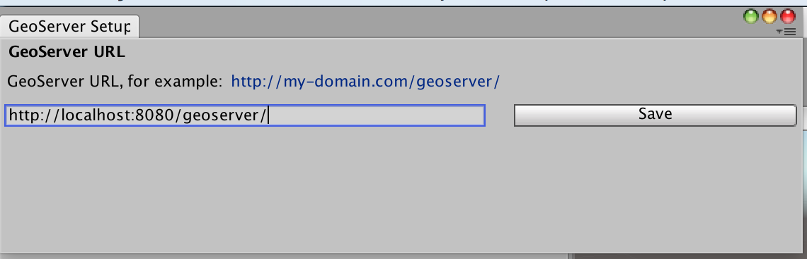

# Mapbox-unity-sdk with GeoServer Support

This fork of [mapbox-unity-sdk](https://github.com/mapbox/mapbox-unity-sdk) allows to retrieve map data from [Mapbox web wervices](https://www.mapbox.com/api-documentation/) and [GeoServer](http://docs.geoserver.org/latest/en/user/index.html). 
GeoServer support is available only in branch [geoserver](https://github.com/FHNW-IVGI/mapbox-unity-sdk/tree/geoserver).

Currently only **vector data** (VectorTiles) is supported.

Modifications are based on [mapbox-unity-sdk_v1.3.0](https://github.com/mapbox/mapbox-unity-sdk/releases/tag/v1.3.0) and tested with **Unity 2017.1.0** and **GeoServer 2.12.1**.

# Getting started

## Building a Unity Package from this Repository


```
git clone https://github.com/FHNW-IVGI/mapbox-unity-sdk.git
cd mapbox-unity-sdk
git checkout geoserver
```

Windows: `update-mapbox-unity-sdk-core.bat`

Linux/Mac: `./update-mapbox-unity-sdk-core.sh`


### Dependencies
This project includes git submodule dependencies outlined in [this gitmodules](https://github.com/mapbox/mapbox-unity-sdk/blob/develop/.gitmodules) file.

To install/update the dependencies after `git clone`/`git pull` run `update-mapbox-unity-sdk-core.bat` or `update-mapbox-unity-sdk-core.sh` (depending on your OS).


### Building a Unity Package
To build a Unity Package for import into your own project from the included `sdkproject`:

1. Start Unity, choose `Open` and navigate to `mapbox-unity-sdk/sdkproject` folder.
2. Select `Mapbox` folder in the project view.
3. Right-click and choose `Export Package...`.


4. Uncheck `Include Dependencies`.


5. Click `Export` and choose a location.

### GeoServer Support
To retrive data from GeoGerver:
1. Configure GeoServer URL in `Mapbox->Setup GeoServer`.

2. TODO

# GeoServer Configuration