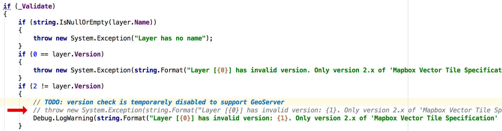
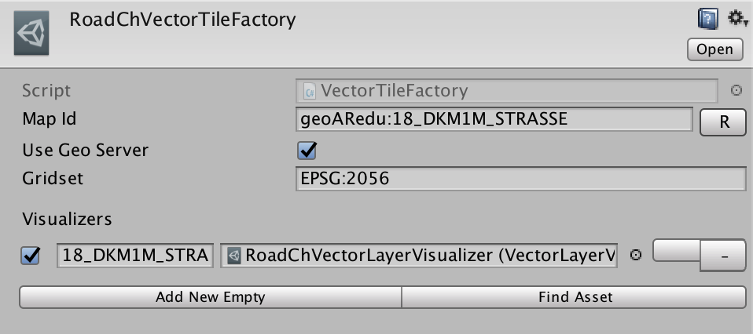

# Mapbox-unity-sdk with GeoServer Support

This fork of [mapbox-unity-sdk](https://github.com/mapbox/mapbox-unity-sdk) allows to retrieve map data from [Mapbox web wervices](https://www.mapbox.com/api-documentation/) and [GeoServer](http://docs.geoserver.org/latest/en/user/index.html). 
GeoServer support is available only in branch [geoserver](https://github.com/FHNW-IVGI/mapbox-unity-sdk/tree/geoserver).

Currently only **vector data** (VectorTiles) is supported.

Modifications are based on [mapbox-unity-sdk_v1.3.0](https://github.com/mapbox/mapbox-unity-sdk/releases/tag/v1.3.0) and tested with **Unity 2017.1.0** and **GeoServer 2.13.0**.

# Getting started

If you didn't work with `mapbox-unity-sdk` before, it is highly recommended to have a look at [Mapbox Unity](https://www.mapbox.com/unity/) documentation and [examples](https://www.mapbox.com/unity-sdk/overview/) first.

## Building a Unity Package from this Repository


```
git clone https://github.com/FHNW-IVGI/mapbox-unity-sdk.git
cd mapbox-unity-sdk
git checkout geoserver
```

Windows: `update-mapbox-unity-sdk-core.bat`

Linux/Mac: `./update-mapbox-unity-sdk-core.sh`


### Dependencies
This project includes git submodule dependencies outlined in [this gitmodules](https://github.com/FHNW-IVGI/mapbox-unity-sdk/blob/geoserver/.gitmodules) file.

To install/update the dependencies after `git clone`/`git pull` run `update-mapbox-unity-sdk-core.bat` or `update-mapbox-unity-sdk-core.sh` (depending on your OS).

In particular, this project depends on the [vector-tile-cs](https://github.com/mapbox/vector-tile-cs) module.

**IMPORTANT**

'vector-tile-cs' module decodes tiles created according to Mapbox Vector Tile (MVT) Specification v2.x, v1.x is not supported. GeoServer 2.13.0 generates tiles according to MTV Specification v1.0. It is possible to use 'vector-tile-cs' with GeoServer 2.13.0 by commenting out the corresponding version check in `mapbox-unity-sdk/sdkproject/Assets/Mapbox/Core/Plugins/Mapbox/vector-tile-cs/VectorTileReader/VectorTileReader.cs#getLayer(byte[] data)`.
The correct decoding of tiles is not garanteed though.

### Building a Unity Package
To build a Unity Package for import into your own project from the included `sdkproject`:

1. Start Unity, choose `Open` and navigate to `mapbox-unity-sdk/sdkproject` folder.
2. Select `Mapbox` folder in the project view.
3. Right-click and choose `Export Package...`.


4. Uncheck `Include Dependencies`.


5. Click `Export` and choose a location.

### GeoServer Support
To retrive data from GeoGerver:

1. Disable MVT version check in `mapbox-unity-sdk/sdkproject/Assets/Mapbox/Core/Plugins/Mapbox/vector-tile-cs/VectorTileReader/VectorTileReader.cs#getLayer(byte[] data)`.



2. Configure GeoServer URL in `Mapbox->Setup GeoServer`.


3. Check 'Use GeoServer' checkbox in VectorTileFactory inspector window.



4. OPTIONAL: adjust 'Gridset' value

Currently only 2 gridsets are suppotred:

- **EPSG:900913** (default): corrensponds to Web Mercator grid which is the only tile grid supported by Mapbox. Vector tiles from this gridset can be combined with vector or raster tiles retrieved from Mapbox since they have the same boundaries. Tiles from this gridset can be used in any Mapbox's `AbstractMap` implementations (`BasicMap`, `MapAtSpecificLocation` etc.)
- **EPSG:2056**: CH1903+ / LV95 Gridset. Can be used only in `SwissBasicMap` with `SwissRangeTileProvider` or `SwissCameraBoundsTileProvider`. See `mapbox-unity-sdk/sdkproject/Assets/Mapbox/Examples/0_GeoServer/SwissMap.unity` scene for configuration example.

### Known Issues
Android build cannot read GeoServer URL configured using 'Setup GeoServer' dialog. 

Workaround: hardcode 'geoServerBaseUrl' value in `MapUtils.cs#MapIdToGeoServerUrl(string id)`